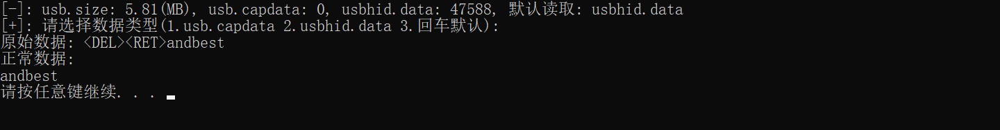
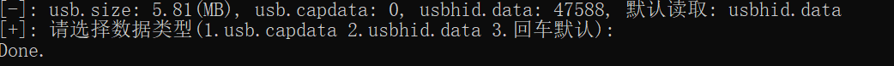
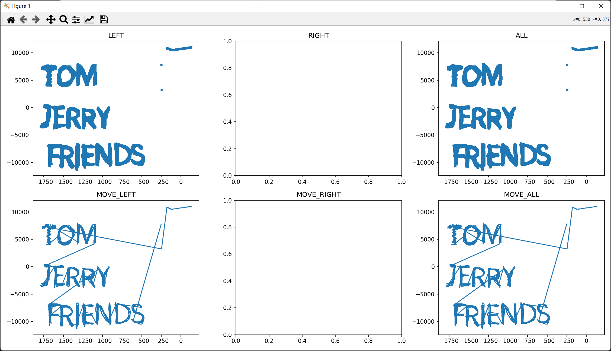

# USB

**关于项目：**

1. 首先你需要有安装wireshark（因为需要用到tshark提取流量内容）。
2. 当你参数传入的是流量包时候，尽量保证流量包名称没有空格和特殊符号等，避免出现找不到流量包的情况。
3. 鼠标流量的 `-new` 参数为可选参数，因为版本问题导致流量的x和y轴位置相反，所以当你在尝试的时候发现绘制的图片不对劲，就要试试带上 `-new` 参数了。

<br>

# Usage

**键盘流量：**

```
Usage: python .\keyboard.py -f <xxx.pcap/xxx.pcapng/xxx.txt>
    example:
        python .\keyboard.py -f .\流量\[UNCTF2022]CatchJerry.pcapng
	    
        python .\mouse.py -f .\demo\[UNCTF2022]CatchJerry.txt
```

<br>

**鼠标流量：**

```
Usage: python .\mouse.py -f <xxx.pcap/xxx.pcapng/xxx.txt> [-new]
    example:
        python .\mouse.py -f .\流量\[UNCTF2022]CatchJerry.pcapng
        python .\mouse.py -f .\流量\2017陕西网络空间安全技术大赛Misc轨迹.pcap -new
        
        python .\mouse.py -f .\demo\[UNCTF2022]CatchJerry.txt
        python .\mouse.py -f .\demo\[GFCTF2021]双击开始冒险.txt -new
```

<br>

# 效果

**键盘流量：**



<br>

**鼠标流量：**






