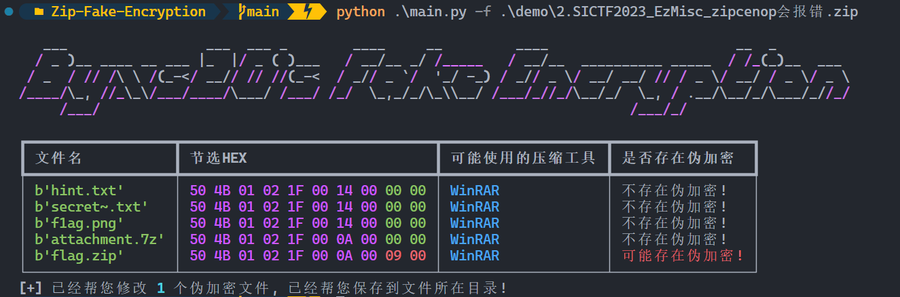

# Zip-Fake-Encryption

**关于项目：**

**解决Zip伪加密文件**

# Usage

```python
usage: main.py [-h] -f F

optional arguments:
  -h, --help  show this help message and exit
  -f F        输入Zip文件
```

# Example

**1.安装库依赖：**

```
pip3 install -r requirements.txt
```

## 效果：

```
$ python .\main.py -f .\demo\2.SICTF2023_EzMisc_zipcenop会报错.zip
```

