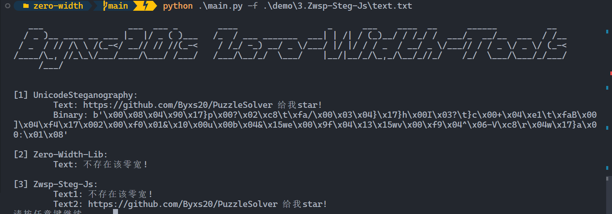

# Zero-Width

**关于项目：**

解决线下赛无网状态遇到零宽的痛点！

解决在选择框中纠结，自动识别使用字符！

# Usage

```
usage: main.py [-h] -f F

optional arguments:
  -h, --help  show this help message and exit
  -f F        输入零宽文件
```

# Example

**1.安装库依赖：**

```
pip3 install -r requirements.txt
```

## 效果：

